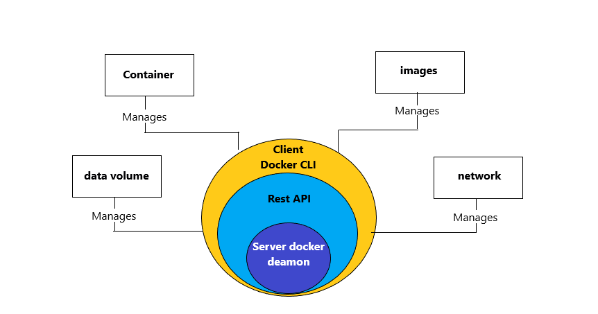

## docker

### Docker Engine

Docker Engine lets  you to develop, assemble, ship, and run application usage of the following components:

1. Docker Daemon
It is a persistent background process that listens for Docker API requests and processes them & manages Docker images, containers, networks, and storage volumes. 

2. Docker Engine REST API
An API utilized by programs to engage with the Docker daemon; it could be accessed with the aid of an HTTP client.

3. Docker CLI
A command-line interface purchaser for interacting with the Docker daemon. It substantially simplifies how you manage container times and is one of the key reasons why developers love the use of Docker.

### docker architechure

Docker architecture
Docker uses a client-server architecture.
The Docker patron talks to the Docker daemon, which does the heavy lifting of building, running, and dispensing your Docker containers.
The Docker patron and daemon can run on the same system, or you may join a Docker consumer to a remote Docker daemon.
The Docker client and daemon talk about the use of a REST API, over UNIX sockets, or a community interface.

