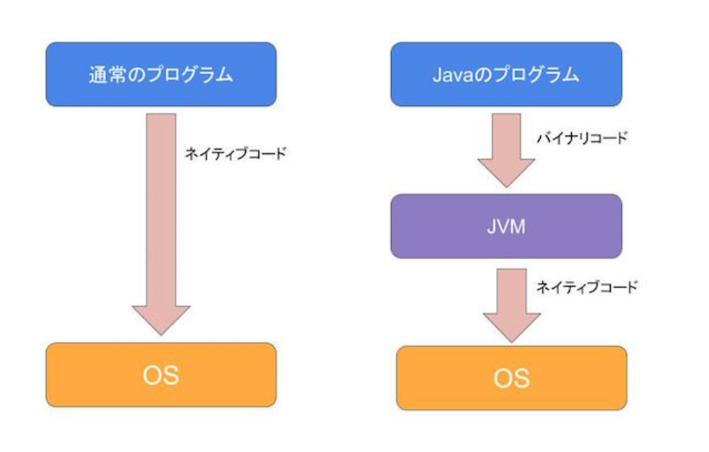
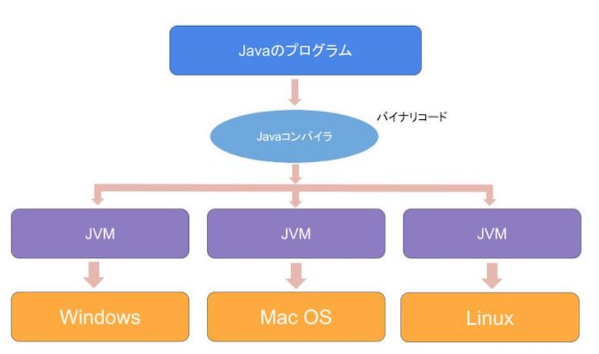

## JVMとは

JVMとはJava Virtual Machineの略で、Javaのプログラムを動かすために必要なソフトウェアです。

Javaは一度プログラムを書けば、どのマシンでもJavaが動くことを思想として作られた言語です。そのため、JVMのような中間コードをプラットフォーム別に、命令文を変換する仮想マシンが実装されました。JVMは「Java仮想マシン」「JavaVM」とも言われています。

